#AWS integration howto 

We assume from that point that you have a registered device on the sigfox backend, associated to a Device Type. 

##1. Create the callback 

* Log onto backend : <https://backend.sigfox.com>
* Click on the tab "Device Type"
* In the list click on the name of the Device Type that you want to modify (usually name in the last column)
* On the left pane, click Callbacks
* On the top right, click New
* At that point you can choose the integration type, for this scenario we will choose "AWS IoT"
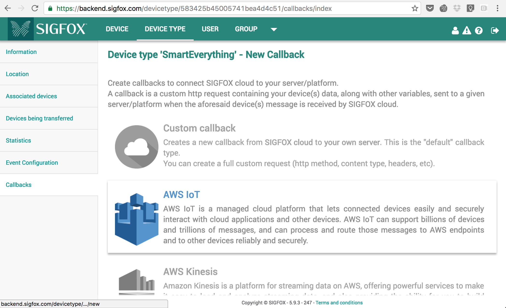
* We know have an empty AWS integration template, click on "Launch Stack"
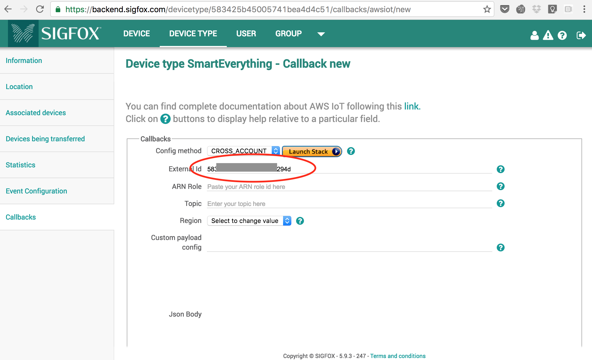
* Another window will open for AWS console, log into AWS if you haven't yet. 
* You can keep the specified Template, so click next.
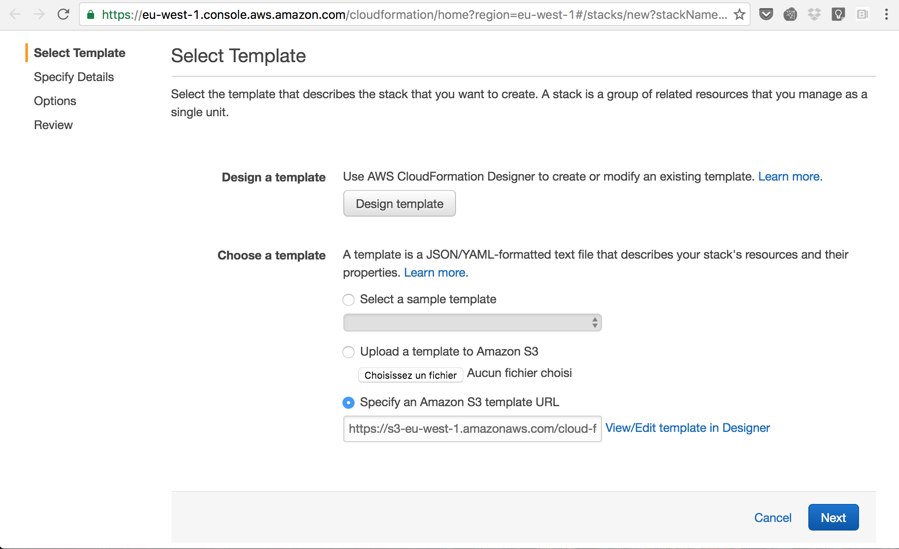
* Next : 
	* copy your AWS Account ID (visible under <https://console.aws.amazon.com/billing/home?#/account>)
	* External ID that was automatically filled in the backend configuration page on Sigfox backend
	* fill in your region (I chose eu-west-1 aka Ireland)
	* Choose a topic name. This will be the MQTT topic that Sigfox messages will be seen under. 
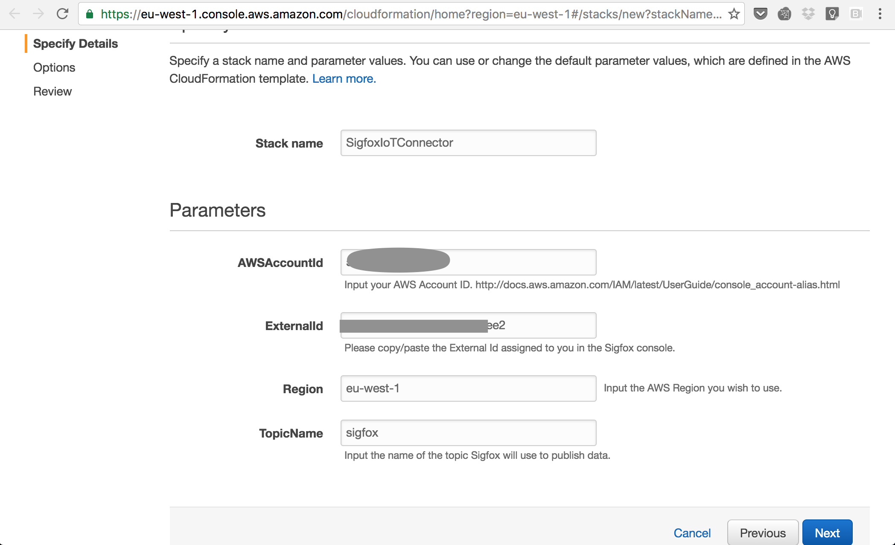
* No specific configuration for this third and last step necessary, click Next
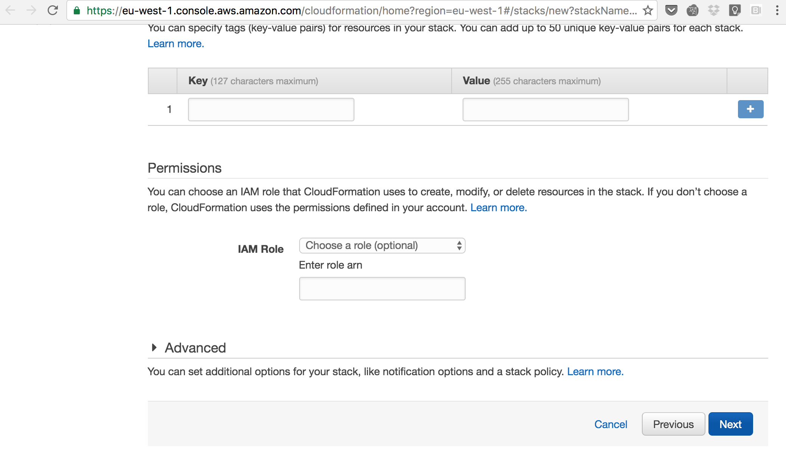
* The last page will summarize all parameter, Acknowledge the creation of IAM parameters, and click Create. 
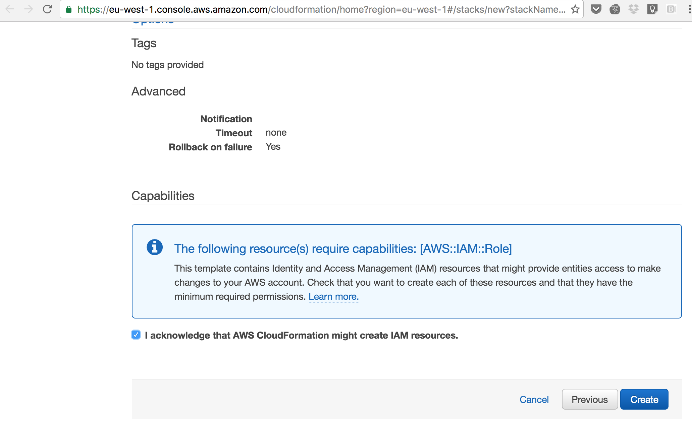
* If you don't have any error, you will be redirected to the Stack list, your new Stack should appear in the list as "UNDER\_CREATION", refresh soon after it will become "CREATE\_COMPLETE". You should look under "Outputs" for the elements that will be copy/pasted back into Sigfox callback configuration. You will later need the "Resources" values as well. 
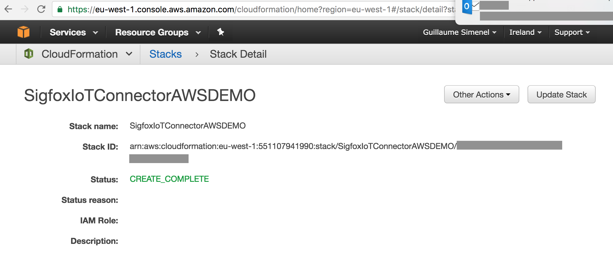
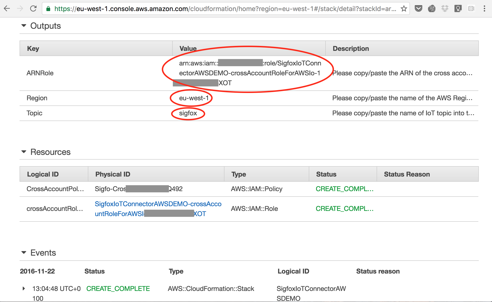
* Go back to Sigfox Backend callback configuration page. 
	* Copy the ARN Role from AWS Stack Outputs ARN Role.
	* Copy Topic from AWS Stack Outputs Topic
	* Choose the same region as in AWS Stack Outputs region. 
	* The normal behaviour for Sigfox is not to touch the payload at all. However for simple payloads and to avoid post treatment of the payload in AWS, you can declare a simple payload grammar. Custom payload config : `temp::float:32`
	* Now you can choose the format of the JSON output from Sigfox backend into AWS. Ours will be Json body : 

			{
			"device" : "{device}",  
			"time" : "{time}",  
			"temperature" : "{customData#temp}"
			}
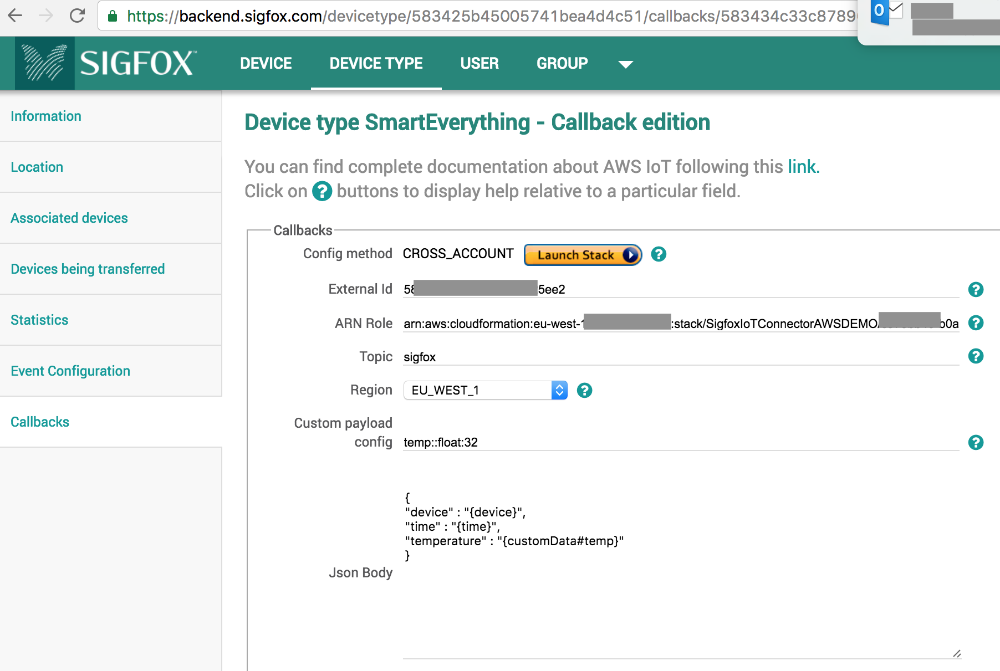
	* We can save the callback. All done here ! 

##2. First test 
* We are going to use a [SmartEverything]('http://www.smarteverything.it/') development board for this test, but this could be done with any other Sigfox compatible board (list available here : <https://partners.sigfox.com/>. This is an Arduino compatible board. I will let you check with another tutorial for the IDE installation, card testing, and first program. 
* Once you are ready to go, plug your board, launch the IDE and copy/paste the following code into the IDE. Compile and upload it on the board. 

~~~c
// Temperature measurement with SmartEverything. 
#include <Arduino.h>
#include <Wire.h>
#include <HTS221.h>

double temperature;
long poll_interval = 900000; // 15 minutes in ms

void setup() {
  // Initiate USB and Sigfox
  SerialUSB.begin(115200);
  while(!SerialUSB) {}
  SigFox.begin(19200);
  SigFox.print("+++");
  SerialUSB.println("Sigfox ready");
  Wire.begin();
  if (!smeHumidity.begin()) { 
    SerialUSB.println("ERROR w/ temperature");
  }
  else {
    SerialUSB.println("Temperature sensor OK");
  }
  
  // Wait for everything to setlle
  delay(500);
}

void loop() {
  // put your main code here, to run repeatedly:
  temperature = smeHumidity.readTemperature();
  // Copy the value
  float fval = (float)temperature;
  // Use pointer to access each Byte in memory
  byte* array = (byte*) &fval; 

  // Let's send the command to Sigfox 
  SigFox.print("AT$SF=");
  for (int i = 3; i >= 0; i--) {
    SigFox.print(array [i], HEX); 
  }
  SigFox.print("\r");
  SerialUSB.println("Message sent");

  delay(poll_interval);
}
~~~
* In Arduino's Serial monitor you should see : 

		Sigfox ready 
		Temperature sensor OK
		Message sent
	
* To have confirmation that everything went fine, log onto <https://backend.sigfox.com> Go to Devices, click on the ID of your device and then messages on the left. You should see your message, with its timestamp and a green arrow under callback. 
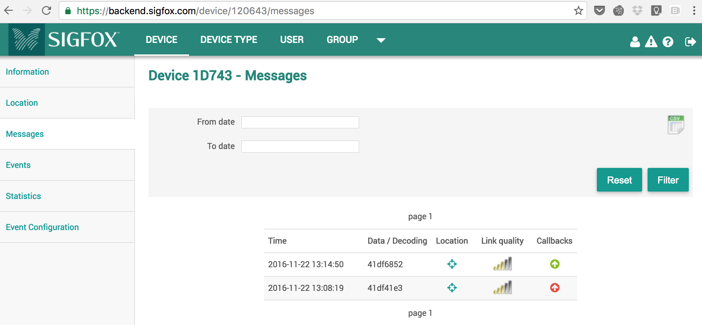

##3. Validate communication up to AWS IOT

* Go back to AWS Stack managemenent, copy the crossAccountRole value. 
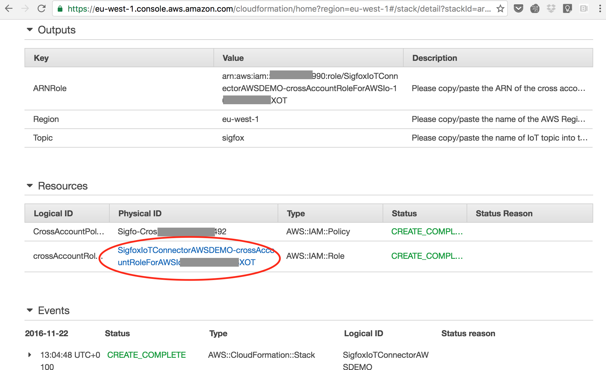
* In AWS IOT, go to the MQTT Client, Paste de crossAccountRole value into Device Gateway Connection, and subscribe to the topic that was chosen during the callback creation, in our case 'sigfox'. If everything goes fine the next time your device will transmit temperature, it will show up in the MQTT client. 
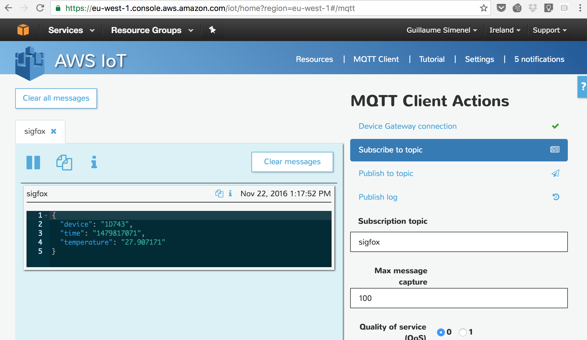

##5. Got questions ? <https://ask.sigfox.com>

##4. Coming up next ! 

AWS resources  
Downlink management  

